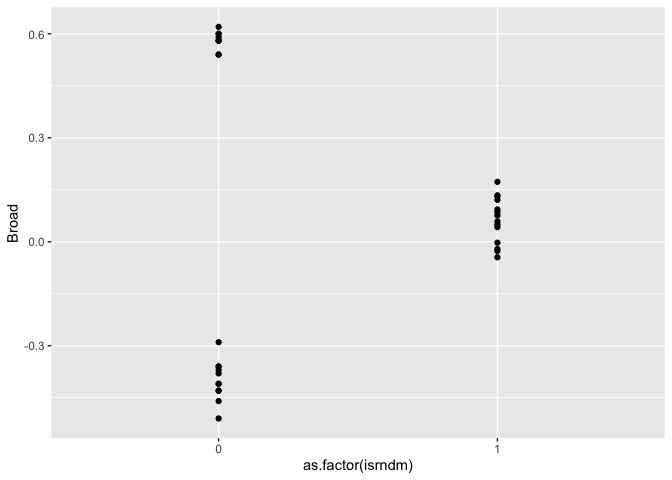
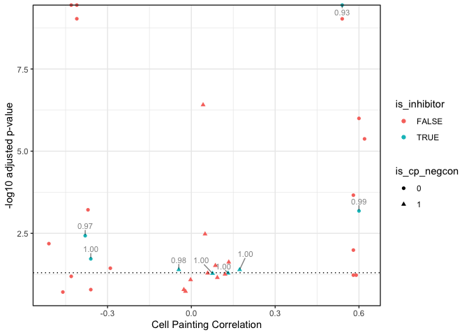
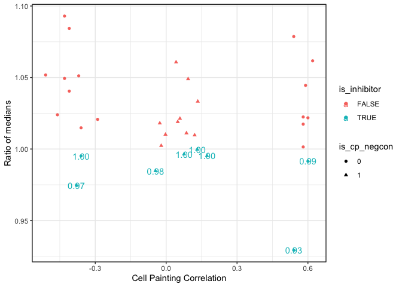

Inspect p38a screen
================

``` r
library(magrittr)
library(tidyverse)
```

Read data and drop `AdjP` because it was computed incorrectly.

``` r
screen_data <- 
  read_csv("input/p38_data.csv") %>%
  select(-AdjP)
```

    ## 
    ## ── Column specification ────────────────────────────────────────────────────────────────────────────────────────────────────────
    ## cols(
    ##   Cmpd = col_character(),
    ##   Broad = col_double(),
    ##   isrndm = col_double(),
    ##   KSP5 = col_double(),
    ##   medTLR5 = col_double(),
    ##   AdjP = col_double()
    ## )

Recompute adjusted P-value from `KSP5`

``` r
screen_data <-
  screen_data %>%
  mutate(AdjP = p.adjust(KSP5, method = "BH"))
```

-   `is_rndm` indicates if the compounds is a Cell Painting negative
    control (based on correlation to the ORF)
-   `medTLR5` is the ratio of the mean of the p38 imaging readout wrt
    DMSO for that compound (mean across the n=4 replicates)
-   `Broad` is the Cell Painting correlation with the ORF

``` r
screen_data
```

<div class="kable-table">

| Cmpd |     Broad | isrndm |      KSP5 |   medTLR5 |      AdjP |
|:-----|----------:|-------:|----------:|----------:|----------:|
| A649 |  0.600000 |      0 | 0.0002126 | 0.9914297 | 0.0006572 |
| A885 | -0.410000 |      0 | 0.0000000 | 1.0404836 | 0.0000000 |
| K015 |  0.172800 |      1 | 0.0246035 | 0.9952669 | 0.0403670 |
| K018 | -0.290000 |      0 | 0.0203473 | 1.0207270 | 0.0364109 |
| K044 |  0.580000 |      0 | 0.0460480 | 1.0224104 | 0.0591184 |
| K082 |  0.580000 |      0 | 0.0000578 | 1.0173847 | 0.0002182 |
| K098 |  0.131600 |      1 | 0.0344407 | 0.9997395 | 0.0513466 |
| K099 |  0.620000 |      0 | 0.0000010 | 1.0616705 | 0.0000042 |
| K160 |  0.075921 |      1 | 0.0370933 | 0.9964375 | 0.0525488 |
| K165 | -0.510000 |      0 | 0.0026828 | 1.0517897 | 0.0065154 |
| K176 | -0.026890 |      1 | 0.1535133 | 1.0180679 | 0.1631630 |
| K177 | -0.360000 |      0 | 0.1535651 | 1.0148250 | 0.1631630 |
| K186 |  0.600000 |      0 | 0.0000002 | 1.0218132 | 0.0000010 |
| K233 |  0.049072 |      1 | 0.0011721 | 1.0189892 | 0.0033210 |
| K323 |  0.058398 |      1 | 0.0347345 | 1.0212986 | 0.0513466 |
| K381 | -0.360000 |      0 | 0.0088932 | 0.9951495 | 0.0188982 |
| K394 |  0.042028 |      1 | 0.0000001 | 1.0607185 | 0.0000004 |
| K430 | -0.410000 |      0 | 0.0000000 | 1.0843442 | 0.0000000 |
| K448 | -0.430000 |      0 | 0.0000000 | 1.0929681 | 0.0000000 |
| K490 |  0.580000 |      0 | 0.0045114 | 1.0014494 | 0.0102259 |
| K495 | -0.460000 |      0 | 0.1931811 | 1.0239405 | 0.1931811 |
| K515 |  0.590000 |      0 | 0.0469469 | 1.0445066 | 0.0591184 |
| K523 | -0.380000 |      0 | 0.0014291 | 0.9745077 | 0.0037377 |
| K537 |  0.085977 |      1 | 0.0159918 | 1.0111237 | 0.0302067 |
| K543 |  0.540000 |      0 | 0.0000000 | 0.9292475 | 0.0000000 |
| K544 | -0.020910 |      1 | 0.1789584 | 1.0023178 | 0.1843813 |
| K580 | -0.045010 |      1 | 0.0249325 | 0.9846655 | 0.0403670 |
| K600 |  0.092975 |      1 | 0.0597894 | 1.0489816 | 0.0700979 |
| K669 |  0.120615 |      1 | 0.0407049 | 1.0096949 | 0.0553587 |
| K825 |  0.540000 |      0 | 0.0000000 | 1.0786624 | 0.0000000 |
| K872 |  0.133940 |      1 | 0.0118425 | 1.0332649 | 0.0236851 |
| K893 | -0.002740 |      1 | 0.0720764 | 1.0101472 | 0.0816866 |
| K923 | -0.430000 |      0 | 0.0530960 | 1.0493500 | 0.0644737 |
| K958 | -0.370000 |      0 | 0.0001791 | 1.0511672 | 0.0006088 |

</div>

Verify the semantics of `isrndm`

``` r
screen_data %>%
  ggplot(aes(as.factor(isrndm), Broad)) + geom_point()
```

<!-- -->
Create new variables

``` r
screen_data <- 
  screen_data %>% 
  mutate(is_inhibitor = medTLR5 < 1)  %>%
  mutate(is_cp_negcon = as.factor(isrndm))
```

Plot KS-test adjusted p-value vs Cell Painting correlation

``` r
p <-
  screen_data %>%
  ggplot(aes(Broad, -log10(AdjP), shape = is_cp_negcon, color = is_inhibitor)) +
  geom_point() +
  ggrepel::geom_text_repel(
    data = screen_data %>% filter(is_inhibitor),
    aes(label = sprintf("%0.2f", medTLR5)),
    max.overlaps = Inf,
    min.segment.length = unit(0, 'lines'),
    nudge_y = .3,
    color = "black",
    alpha = 0.5,
    size = 3
  ) +
  
  geom_hline(yintercept = -log10(0.05), linetype = "dotted") +
  coord_cartesian(clip = "off") +
  xlab("Cell Painting Correlation") +
  ylab("-log10 adjusted p-value") +
  theme_bw()

print(p)
```

<!-- -->

``` r
ggsave("output/p38_figure_pvalue.png", width = 6, height = 4)
```

Plot ratio of medians of compounds:DMSO vs Cell Painting correlation

``` r
p <- 
  screen_data %>%
  ggplot(aes(Broad, medTLR5, shape = is_cp_negcon, color = is_inhibitor)) + 
  geom_point() + 
  geom_text(
    aes(label = sprintf("%0.02f", medTLR5)), data = screen_data %>% filter(is_inhibitor)
  ) +
  coord_cartesian(clip = "off") +
  xlab("Cell Painting Correlation") +
  ylab("Ratio of medians") + 
  theme_bw()

print(p)
```

<!-- -->

``` r
ggsave("output/p38_figure_ratio_median.png", width = 6, height = 4)
```
