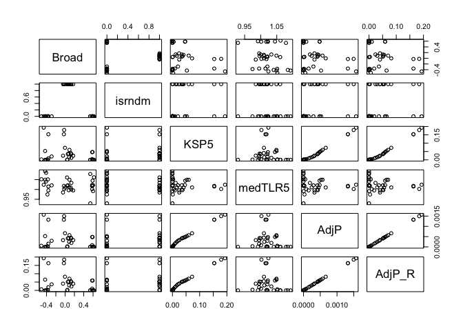

Inspect p38a screen
================

``` r
library(magrittr)
library(tidyverse)
```

``` r
screen_data <- read_csv("input/p38_data.csv")
```

    ## 
    ## ── Column specification ──────────────────────────────────────────────────────────────────────────────────────
    ## cols(
    ##   Cmpd = col_character(),
    ##   Broad = col_double(),
    ##   isrndm = col_double(),
    ##   KSP5 = col_double(),
    ##   medTLR5 = col_double(),
    ##   AdjP = col_double()
    ## )

Recompute adjusted P-value from `KSP5`

``` r
screen_data <-
  screen_data %>%
  mutate(AdjP_R = p.adjust(KSP5, method = "BH"))
```

There’s a linear relationship with `AdjP` but the slope is off.

``` r
screen_data %>%
  ggplot(aes(AdjP_R / 1.231322e+02, AdjP)) + geom_point() + geom_abline(slope = 1)
```

<!-- -->

`AdjP` is a factor of `1.231322e+02` lower for some reason

``` r
lm(AdjP_R ~ AdjP, screen_data) %>%
  broom::tidy()
```

<div class="kable-table">

| term        | estimate | std.error |    statistic |   p.value |
|:------------|---------:|----------:|-------------:|----------:|
| (Intercept) |   0.0000 |     0e+00 | 1.906872e+00 | 0.0655493 |
| AdjP        | 123.1322 |     1e-07 | 1.431443e+09 | 0.0000000 |

</div>

``` r
screen_data %>% 
  select(Broad:AdjP_R) %>%
  pairs()
```

<!-- -->

-   `is_rndm` indicates if the compounds is a Cell Painting negative
    control (based on correlation to the ORF)
-   `medTLR5` is the ratio of the mean of the p38 imaging readout wrt
    DMSO for that compound (mean across the n=4 replicates)
