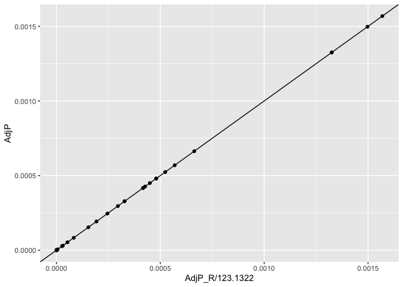

Inspect p38a screen
================

``` r
library(magrittr)
library(tidyverse)
```

``` r
screen_data <- read_csv("input/p38_data.csv")
```

    ## 
    ## ── Column specification ──────────────────────────────────────────────────────────────────────────────────────────────────────────────────────────────────────────────
    ## cols(
    ##   Cmpd = col_character(),
    ##   Broad = col_double(),
    ##   isrndm = col_double(),
    ##   KSP5 = col_double(),
    ##   medTLR5 = col_double(),
    ##   AdjP = col_double()
    ## )

Recompute adjusted P-value from `KSP5`

``` r
screen_data <-
  screen_data %>%
  mutate(AdjP_recomputed = p.adjust(KSP5, method = "BH"))
```

There’s a linear relationship with `AdjP` but the slope is off.

``` r
screen_data %>%
  ggplot(aes(AdjP_recomputed, AdjP)) + geom_point() + geom_abline(slope = 1)
```

<!-- -->
`AdjP` is a factor of `8.121353e-03` lower for some reason

``` r
lm(AdjP ~ AdjP_recomputed, screen_data) %>%
  broom::tidy()
```

<div class="kable-table">

| term             |  estimate | std.error |     statistic |   p.value |
|:-----------------|----------:|----------:|--------------:|----------:|
| (Intercept)      | 0.0000000 |         0 | -1.906872e+00 | 0.0655493 |
| AdjP\_recomputed | 0.0081214 |         0 |  1.431444e+09 | 0.0000000 |

</div>
