Inspect p38a single cell data
================

``` r
library(magrittr)
library(glue)
library(tidyverse)
```

``` r
single_cell <-
  read_csv(
    "input/p38_single_cell_all_conc.csv.gz",
    col_types = cols(
      P = col_integer(),
      R = col_integer(),
      C = col_integer(),
      Cmpd = col_character(),
      Conc = col_double(),
      Broad = col_double(),
      isrndm = col_logical(),
      KS5 = col_double(),
      KSP5 = col_double(),
      diff5 = col_double(),
      TLR5 = col_double()
    )
  )
```

-   `is_rndm` indicates if the compounds is a Cell Painting negative
    control (based on correlation to the ORF)
-   `Broad` is the Cell Painting correlation with the ORF
-   `KS5`: KS statistic
-   `KSP5`: KS p value
-   `diff5`: ratio of median of compound to median of DMSO
-   `TLR5`: raw p38 activity for that cell

``` r
single_cell <-
  single_cell %>%
  mutate(is_dmso = Cmpd == "DMSO") %>%
  mutate(Cmpd = ifelse(is_dmso, "_DMSO", Cmpd)) %>%
  mutate(is_cp_negcon = isrndm == 1)
```

``` r
single_cell %>% 
  filter(is.na(TLR5)) %>%
  count(P)
```

<div class="kable-table">

|   P |   n |
|----:|----:|
|   8 |   1 |

</div>

``` r
single_cell <-
  single_cell %>% 
  filter(!is.na(TLR5))
```

No perturbations in P=10

``` r
single_cell %>%
  filter(!is_dmso) %>%
  count(P)
```

<div class="kable-table">

|   P |      n |
|----:|-------:|
|   1 |  75118 |
|   2 | 116775 |
|   3 | 196653 |
|   4 |  94690 |
|   5 | 147099 |
|   6 | 192569 |
|   7 |  99542 |
|   8 | 237263 |
|   9 | 183063 |

</div>

``` r
single_cell <-
  single_cell %>%
  filter(P != 10)
```

\~99.9% of the values are &lt; 1.06

``` r
single_cell %>%
  group_by(P) %>%
  summarise(q999 = quantile(TLR5, c(.999))) %>%
  arrange(desc(q999))
```

<div class="kable-table">

|   P |      q999 |
|----:|----------:|
|   8 | 1.0624893 |
|   7 | 1.0481029 |
|   9 | 1.0341056 |
|   6 | 1.0326154 |
|   4 | 0.9857357 |
|   2 | 0.9734470 |
|   1 | 0.9685912 |
|   3 | 0.9654807 |
|   5 | 0.9288070 |

</div>

``` r
single_cell <-
  single_cell %>%
  filter(TLR5 < quantile(TLR5, 0.999))
```

> p38 activity in single cells was calculated using the ratio of the
> median intensity of the p38-KTR in a 5-pixel-wide cytoplasmic ring
> around the nucleus to the median intensity of the p38-KTR in the
> nucleus.

``` r
single_cell %>% 
  filter(TLR5 < 0) %>%
  count(P)
```

<div class="kable-table">

|   P |   n |
|----:|----:|
|   1 |   2 |
|   2 |   1 |
|   3 |   2 |
|   5 |  47 |
|   6 | 183 |
|   7 |  61 |
|   8 |  61 |
|   9 |   1 |

</div>

``` r
single_cell <- 
  single_cell %>%
  filter(TLR5 >= 0) 
```

``` r
single_cell %>%
  ggplot(aes(TLR5, fill = is_dmso)) + 
  geom_histogram(position="identity", alpha = 0.5, bins = 50) + 
  facet_wrap(~P, ncol = 3, scales = "free_x")
```

<!-- -->

There are two DMSO’s in each of the 10 columns

``` r
single_cell %>%
  filter(is_dmso) %>%
  distinct(P, R, C) %>%
  count(P, C) %>%
  ggplot(aes(C, n)) + 
  geom_point() + 
  facet_wrap(~P) +
  xlab("Column") +
  ylab("Number of DMSO wells")
```

<!-- -->

There’s some evidence of column effect

``` r
single_cell %>%
  filter(is_dmso) %>%
  ggplot(aes(TLR5, group = C)) + geom_density() + facet_wrap(~P)
```

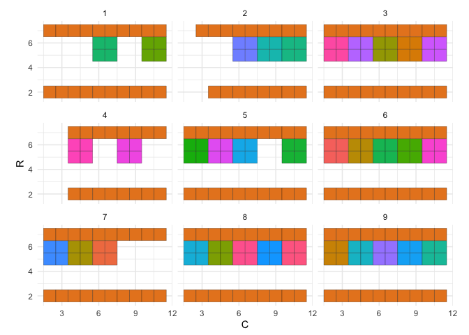<!-- -->

``` r
single_cell %>%
  filter(is_dmso) %>%
  group_by(P, C) %>%
  summarise(mean_TLR5 = mean(TLR5), .groups = "keep") %>%
  ggplot(aes(as.factor(P), mean_TLR5)) + 
  geom_boxplot() +
  ggtitle("Distribution of mean TLR5 values in DMSO wells")
```

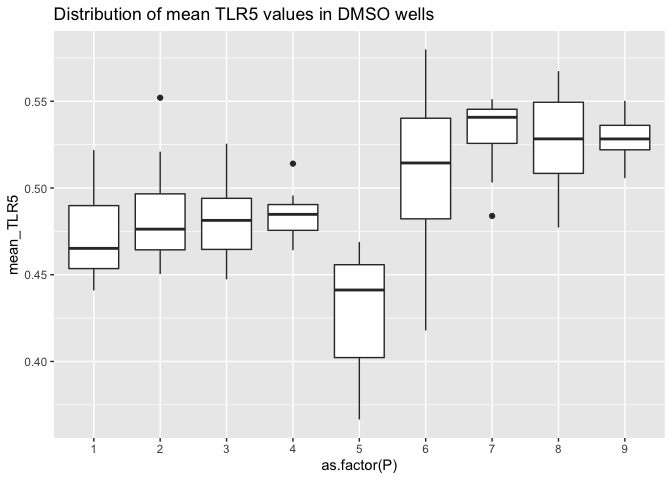<!-- -->

Likely not much of row effect (but hard to know because it’s just n = 2)

``` r
single_cell %>%
  filter(is_dmso) %>%
  ggplot(aes(TLR5, group = R)) + geom_density() + facet_wrap(~P)
```

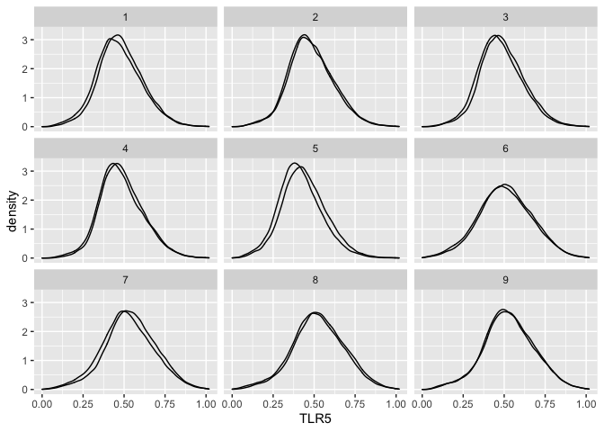<!-- -->

Normalizing w.r.t. DMSO in the same column is therefore justified.

Inspect the plate layout.

``` r
single_cell %>%
  distinct(P, R, C, Cmpd) %>%
  ggplot(aes(C, R, fill = Cmpd)) + 
  geom_tile(color = "black") + 
  coord_equal() + 
  theme_minimal() + 
  facet_wrap(~P) +
  theme(legend.position = "none")
```

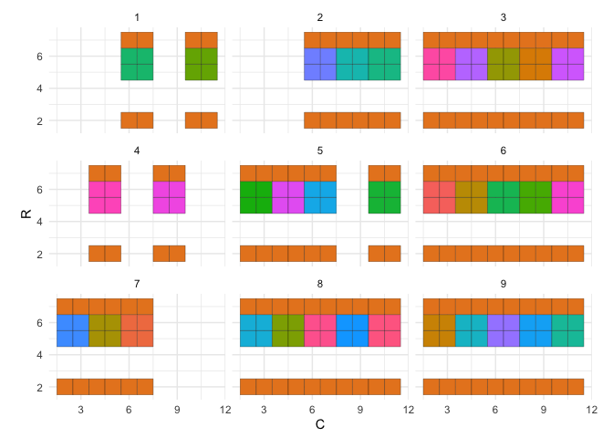<!-- -->
A compound is present only on a single plate

``` r
single_cell %>%
  filter(!is_dmso) %>%
  distinct(P, Cmpd) %>%
  count(Cmpd) %>% 
  filter(n > 1)
```

<div class="kable-table">

Cmpd n —— —

</div>

Trim DMSOs

``` r
single_cell <-
  single_cell %>%
  inner_join(single_cell %>%
               filter(!is_dmso) %>%
               distinct(P, C))
```

    ## Joining, by = c("P", "C")

Inspect the plate layout.

``` r
single_cell %>%
  distinct(P, R, C, Cmpd) %>%
  ggplot(aes(C, R, fill = Cmpd)) + 
  geom_tile(color = "black") + 
  coord_equal() + 
  theme_minimal() + 
  facet_wrap(~P) +
  theme(legend.position = "none")
```

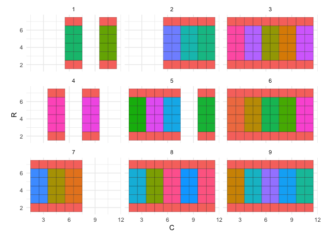<!-- -->

``` r
compute_statistics <- function(population, sample, variable) {
  
  population %>%
    group_by(P, R, C, Cmpd, Conc, Broad, is_cp_negcon, diff5) %>%
    summarise(ks_pval = ks.test(.data[[variable]], sample[[variable]])$p.value,
              ks_stat = ks.test(.data[[variable]], sample[[variable]])$statistic,
              t_pval = t.test(.data[[variable]], sample[[variable]])$p.value,
              t_stat = t.test(.data[[variable]], sample[[variable]])$statistic,
              median_ratio = median(.data[[variable]]) / median(sample[[variable]]), 
              cell_count = n(),
              .groups = "keep")
}
```

``` r
statistics <-
  cytominer::stratify(
  population = single_cell %>% filter(!is_dmso),
  sample = single_cell %>% filter(is_dmso),
  reducer = compute_statistics,
  strata = c("P", "C"),
  variable = "TLR5"
)
```

Statistics are computed per replicate (n=4) for each of the 34
compounds, at each concentration

``` r
statistics %>%
  count(Cmpd, Conc) %>%
  count(n)
```

    ## Storing counts in `nn`, as `n` already present in input
    ## ℹ Use `name = "new_name"` to pick a new name.

<div class="kable-table">

|   n |  nn |
|----:|----:|
|   4 |  68 |

</div>

``` r
statistics %>%
  ggplot(aes(Cmpd, cell_count, fill = as.factor(Conc))) + 
  geom_boxplot(position = "dodge") +
  scale_x_discrete(guide = guide_axis(n.dodge = 2)) + 
  facet_wrap(~is_cp_negcon, scales = "free_x", 
             labeller = labeller(.cols = label_both)) +
  theme(legend.position = "bottom")
```

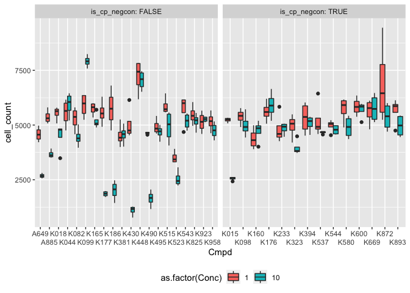<!-- -->

``` r
statistics %>%
  ggplot(aes(Cmpd, t_stat, fill = as.factor(Conc))) + 
  geom_boxplot(position = "dodge") +
  scale_x_discrete(guide = guide_axis(n.dodge = 2)) + 
  facet_wrap(~is_cp_negcon, scales = "free_x", 
             labeller = labeller(.cols = label_both)) +
  theme(legend.position = "bottom")
```

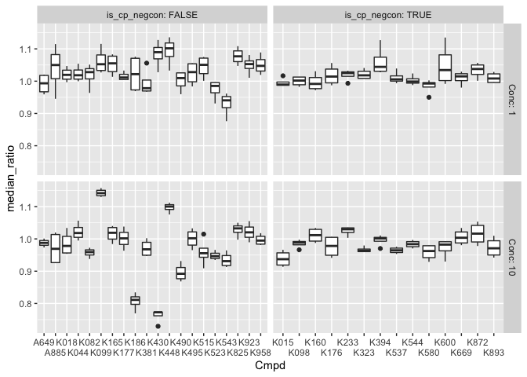<!-- -->

``` r
statistics %>%
  ggplot(aes(Cmpd, ks_stat, fill = as.factor(Conc))) + 
  geom_boxplot(position = "dodge") +
  scale_x_discrete(guide = guide_axis(n.dodge = 2)) + 
  facet_wrap(~is_cp_negcon, scales = "free_x", 
             labeller = labeller(.cols = label_both)) +
  theme(legend.position = "bottom")
```

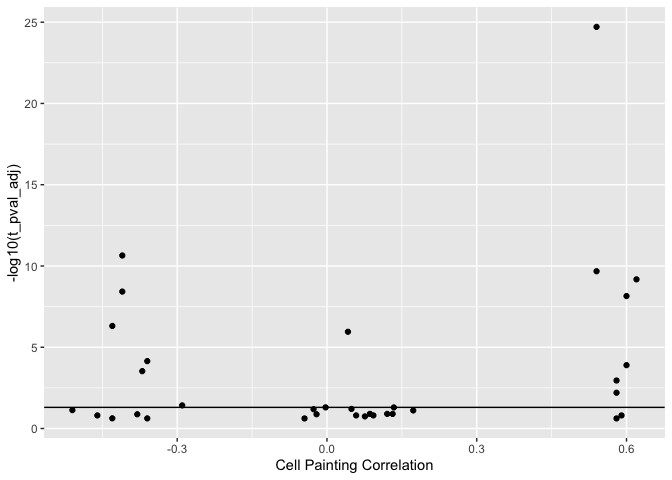<!-- -->

``` r
plot_distribution <- function(Cmpdi, Conci) {
  statistics_i <-
    statistics %>%
    filter(Cmpd == Cmpdi & Conc == Conci) %>%
    summarise(across(all_of(
      c("ks_pval", "ks_stat", "t_pval", "t_stat", "Broad", "is_cp_negcon")
    ), mean)) %>%
    mutate(is_cp_negcon = is_cp_negcon == 1)
  
  cp_type <- ifelse(statistics_i$is_cp_negcon, "cpneg", "cphit")
  cmpd_single_cell <-
    single_cell %>%
    ungroup() %>%
    filter(Cmpd == Cmpdi & Conc == Conci)
  
  dmso_single_cell <-
    cmpd_single_cell %>%
    distinct(P, C) %>%
    inner_join(single_cell %>% filter(is_dmso), by = c("P", "C"))
  
  combined_single_cell <-
    bind_rows(dmso_single_cell,
              cmpd_single_cell)
  
  p <-
    combined_single_cell %>%
    ggplot(aes(TLR5, fill = Cmpd)) +
    geom_density(position = "identity",
                   alpha = 0.5) +
    facet_wrap( ~ C) +
    ggtitle(glue("{cp_type}_{Cmpdi}_{Conci}"),
            subtitle =
              with(
                statistics_i,
                sprintf(
                  "ks_stat = %.2f ks_pval = %.2g t_stat = %.1f t_pval = %.2g cp_cor = %.2f",
                  ks_stat,
                  ks_pval,
                  t_stat,
                  t_pval,
                  Broad
                )
              )) 
  
  ggsave(
    glue("output/distributions/{cp_type}_{Cmpdi}_conc_{Conci}.png"),
    p,
    width = 6,
    height = 4
  )
}
```

``` r
statistics %>%
  distinct(Cmpd, Conc) %>%
  pwalk(plot_distribution)
```

``` r
statistics_agg <-
  statistics %>%
  group_by(Cmpd, Conc) %>%
  summarise(across(all_of(
    c("ks_pval", "ks_stat", "t_pval", "t_stat", "median_ratio", "cell_count", "Broad", "is_cp_negcon", "diff5")
  ), mean), 
  .groups = "keep") %>%
  ungroup() %>%
  mutate(t_pval_adj = p.adjust(t_pval, "BH"),
         ks_pval_adj = p.adjust(ks_pval, "BH"),
         is_cp_negcon = is_cp_negcon == 1) %>%
  mutate(t_pval_adj_neglog = -log10(t_pval_adj),
         ks_pval_adj_neglog = -log10(ks_pval_adj)) %>%
  mutate(is_inhibitor = median_ratio < 1)
```

``` r
plot_conc_comparision <- 
  function(readout, 
           annotate_column = FALSE,
           strong_effect_threshold = 2) {
  statistics_agg <-
    statistics_agg %>%
    pivot_wider(
      c(Cmpd, is_cp_negcon),
      names_from = "Conc",
      names_prefix = "conc_",
      values_from = readout
    )
  
  p <-
    statistics_agg %>%
    ggplot(aes(conc_1, conc_10)) +
    geom_point() +
    ggtitle(readout) +
    coord_equal(clip = "off") +
    geom_abline(slope = 1)
  
  if (annotate_column) {
    p <- p +
      ggrepel::geom_text_repel(
        data = statistics_agg %>%
          filter(
            conc_1 > strong_effect_threshold
          ),
        aes(label = Cmpd),
        max.overlaps = Inf,
        min.segment.length = unit(0, 'lines'),
        nudge_y = .3,
        color = "black",
        alpha = 0.5,
        size = 3
      )
  }
  
  p
}

plot_conc_comparision("cell_count")
```

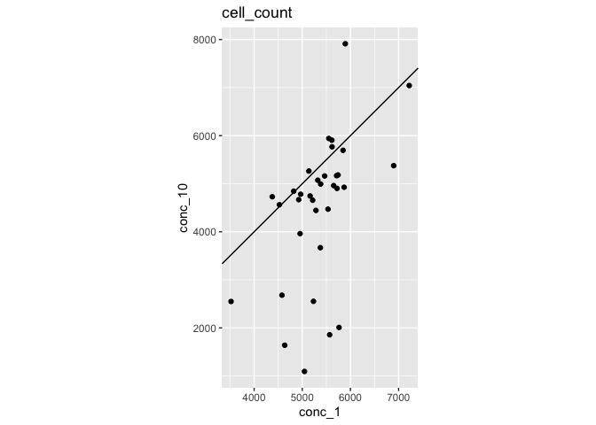<!-- -->

``` r
plot_conc_comparision("ks_pval_adj_neglog", annotate_column = TRUE, strong_effect_threshold = 2)
```

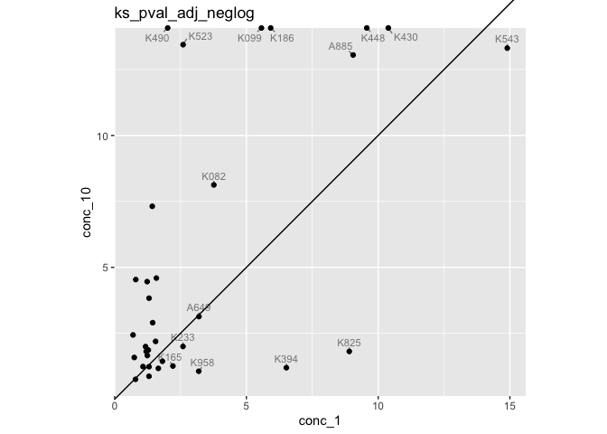<!-- -->

``` r
screen_data <- 
  read_csv("input/p38_data.csv") 
```

    ## Rows: 34 Columns: 6
    ## ── Column specification ─────────────────────────────────────────────────────────────────────────────────────────────────────────────────
    ## Delimiter: ","
    ## chr (1): Cmpd
    ## dbl (5): Broad, isrndm, KSP5, medTLR5, AdjP
    ## 
    ## ℹ Use `spec()` to retrieve the full column specification for this data.
    ## ℹ Specify the column types or set `show_col_types = FALSE` to quiet this message.

``` r
combined_data <-
  inner_join(
    statistics_agg %>% filter(Conc == 1) %>% select(Cmpd, ks_pval, median_ratio),
    screen_data %>% select(Cmpd, KSP5, medTLR5)
  )
```

    ## Joining, by = "Cmpd"

``` r
combined_data %>%
  ggplot(aes(ks_pval, KSP5)) +
  geom_point() +
  coord_equal() +
  geom_abline(slope = 1) +
  xlab("ks p-value (R)") +
  ylab("ks p-value (Matlab)")
```

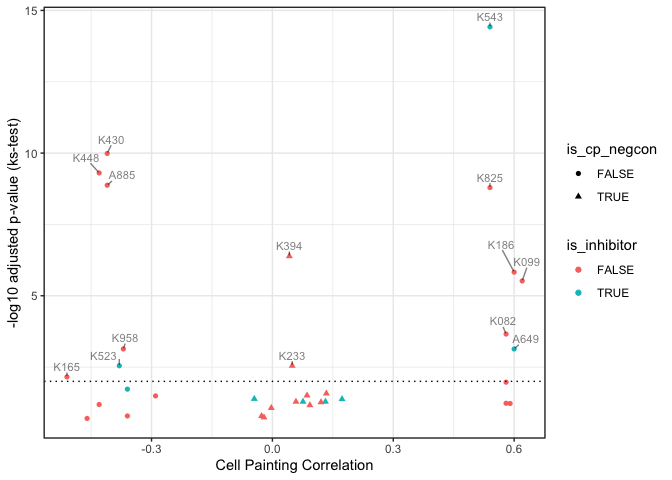<!-- -->

``` r
combined_data %>%
  ggplot(aes(median_ratio, medTLR5)) +
  geom_point() +
  coord_equal() +
  geom_abline(slope = 1) +
  xlab("median ratio (R)") +
  ylab("median ratio (Matlab)")
```

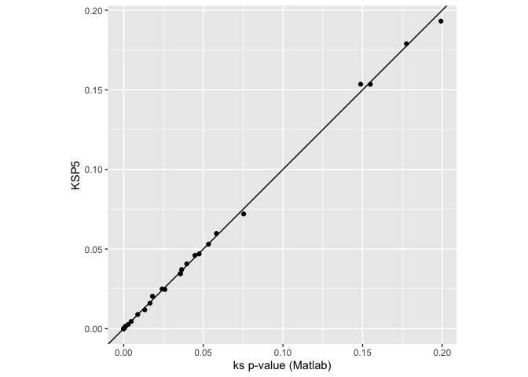<!-- -->

``` r
plot_paper_figure <- 
  function(test_type, 
           annotate_column, 
           Conci,
           strong_effect_threshold = 2) {
  
  statistics_agg <-
    statistics_agg %>%
    filter(Conc == Conci) %>%
    mutate(pval_adj = .data[[paste0(test_type, "_pval_adj")]])
    
  p <- 
    statistics_agg %>%
    ggplot(aes(Broad, -log10(pval_adj), shape = is_cp_negcon, color = is_inhibitor)) +
    geom_point()
  
  if (annotate_column == "median_ratio") {
    p <- p +
      ggrepel::geom_text_repel(
        data = statistics_agg %>% filter(is_inhibitor),
        aes(label = sprintf("%0.2f", median_ratio)),
        max.overlaps = Inf,
        min.segment.length = unit(0, 'lines'),
        nudge_y = .3,
        color = "black",
        alpha = 0.5,
        size = 3
      )
  }
  
  if (annotate_column == "significant") {
    p <- p +
      ggrepel::geom_text_repel(
        data = statistics_agg %>% filter(-log10(pval_adj) > strong_effect_threshold),
        aes(label = Cmpd),
        max.overlaps = Inf,
        min.segment.length = unit(0, 'lines'),
        nudge_y = .3,
        color = "black",
        alpha = 0.5,
        size = 3
      )
    
  }
  
  p <- p +
    geom_hline(yintercept = -log10(0.01), linetype = "dotted") +
    coord_cartesian(clip = "off") +
    xlab("Cell Painting Correlation") +
    ylab(glue("-log10 adjusted p-value ({test_type}-test)")) +
    theme_bw()
  
  p <- p + ggtitle(glue("Conc = {Conci}"))
  
  ggsave(
    glue("output/p38_{test_type}_tlr_annot_{annotate_column}_conc_{Conci}.png"),
    width = 6,
    height = 4
  )
  
  ggsave(
    glue("output/p38_{test_type}_tlr_annot_{annotate_column}_conc_{Conci}.svg"),
    width = 6,
    height = 4
  )  
  
  p
}
```

``` r
Conci <- 1

p <- plot_paper_figure("ks", "median_ratio", Conci)

print(p)
```

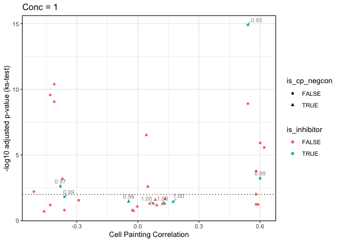<!-- -->

``` r
p <- plot_paper_figure("ks", "significant", Conci)

print(p)
```

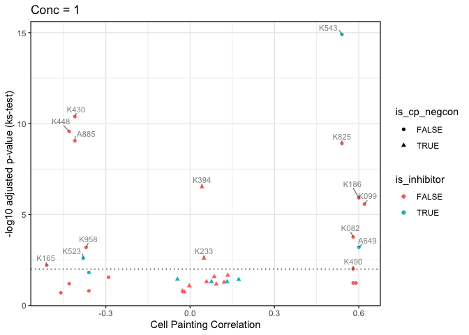<!-- -->

``` r
p <- plot_paper_figure("t", "median_ratio", Conci)

print(p)
```

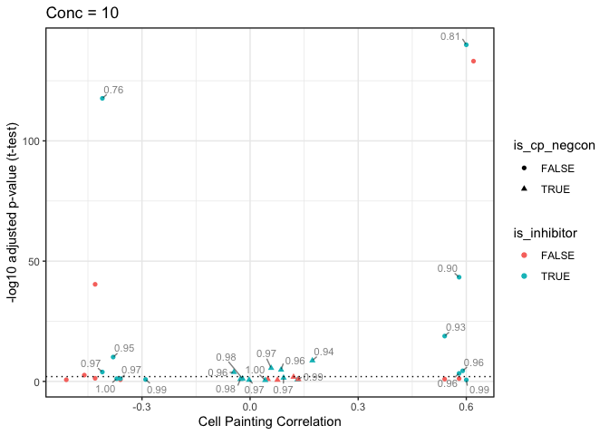<!-- -->

``` r
p <- plot_paper_figure("t", "significant", Conci)

print(p)
```

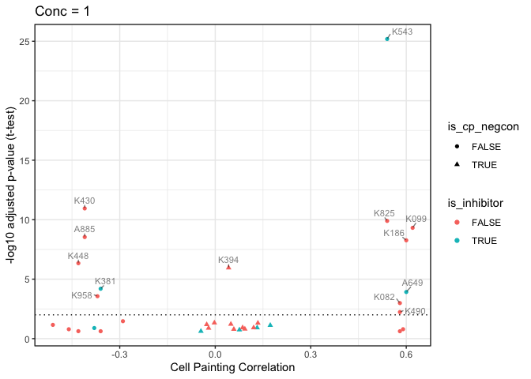<!-- -->

``` r
Conci <- 10

p <- plot_paper_figure("ks", "median_ratio", Conci)

print(p)
```

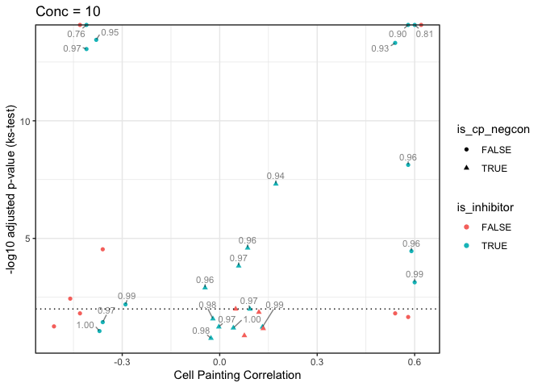<!-- -->

``` r
p <- plot_paper_figure("ks", "significant", Conci)

print(p)
```

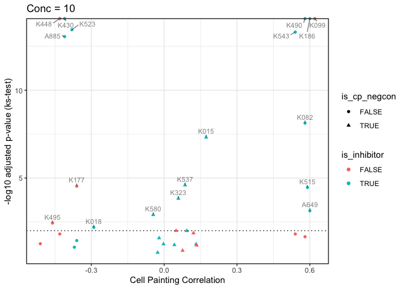<!-- -->

``` r
p <- plot_paper_figure("t", "median_ratio", Conci)

print(p)
```

<!-- -->

``` r
p <- plot_paper_figure("t", "significant", Conci)

print(p)
```

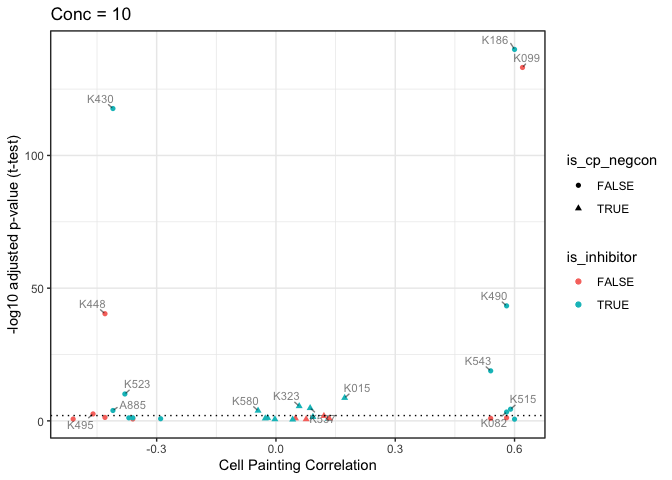<!-- -->

``` r
statistics_agg %>% 
  mutate(is_significant_t_test_01 = t_pval_adj < 0.01) %>%
  count(Conc, is_cp_negcon, is_significant_t_test_01)
```

<div class="kable-table">

| Conc | is\_cp\_negcon | is\_significant\_t\_test\_01 |   n |
|-----:|:---------------|:-----------------------------|----:|
|    1 | FALSE          | FALSE                        |   8 |
|    1 | FALSE          | TRUE                         |  12 |
|    1 | TRUE           | FALSE                        |  13 |
|    1 | TRUE           | TRUE                         |   1 |
|   10 | FALSE          | FALSE                        |   9 |
|   10 | FALSE          | TRUE                         |  11 |
|   10 | TRUE           | FALSE                        |  10 |
|   10 | TRUE           | TRUE                         |   4 |

</div>

``` r
statistics_agg %>% 
  mutate(is_significant_ks_test_01 = ks_pval_adj < 0.01) %>%
  count(Conc, is_cp_negcon, is_significant_ks_test_01)
```

<div class="kable-table">

| Conc | is\_cp\_negcon | is\_significant\_ks\_test\_01 |   n |
|-----:|:---------------|:------------------------------|----:|
|    1 | FALSE          | FALSE                         |   7 |
|    1 | FALSE          | TRUE                          |  13 |
|    1 | TRUE           | FALSE                         |  12 |
|    1 | TRUE           | TRUE                          |   2 |
|   10 | FALSE          | FALSE                         |   6 |
|   10 | FALSE          | TRUE                          |  14 |
|   10 | TRUE           | FALSE                         |  10 |
|   10 | TRUE           | TRUE                          |   4 |

</div>

``` r
statistics_agg %>%
  ggplot(aes(Broad, median_ratio)) + 
  geom_point() + 
  xlab("Cell Painting Correlation") +
  coord_cartesian(clip = "off") + 
  facet_wrap(~Conc)
```

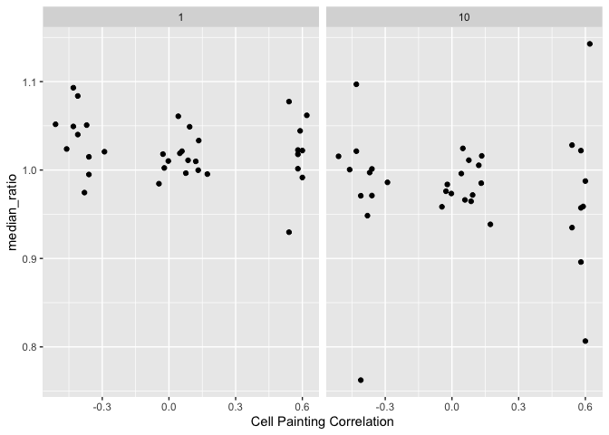<!-- -->

``` r
statistics_agg %>%
  ggplot(aes(Broad, t_stat)) + 
  geom_point() +
  xlab("Cell Painting Correlation") +
  coord_cartesian(clip = "off") + 
  facet_wrap(~Conc)
```

<!-- -->

``` r
statistics_agg %>%
  ggplot(aes(Broad, ks_stat)) + 
  geom_point() +
  xlab("Cell Painting Correlation") +
  coord_cartesian(clip = "off") + 
  facet_wrap(~Conc)
```

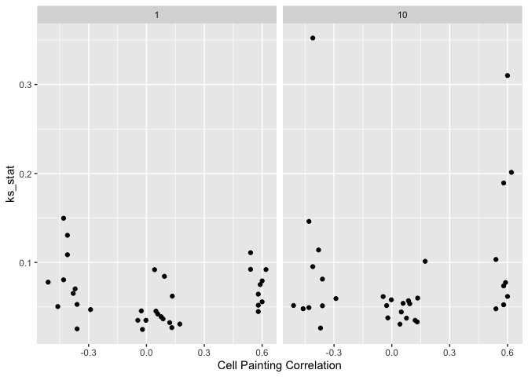<!-- -->

``` r
statistics_agg %>%
  mutate(across(where(is.double), ~sprintf("%.2g", .))) %>%
  write_csv("output/statistics_agg.csv")
```
