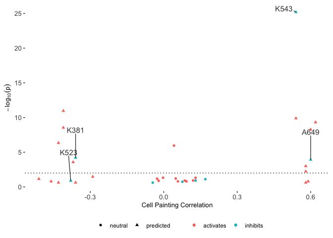

Plot figures for paper
================

``` r
library(magrittr)
library(glue)
library(tidyverse)
```

``` r
statistics_agg <- read_csv("output/statistics_agg.csv")
```

    ## 
    ## ── Column specification ─────────────────────────────────────────────────────────────────────────────────────────────────
    ## cols(
    ##   Cmpd = col_character(),
    ##   Conc = col_double(),
    ##   ks_pval = col_double(),
    ##   ks_stat = col_double(),
    ##   t_pval = col_double(),
    ##   t_stat = col_double(),
    ##   median_ratio = col_double(),
    ##   cell_count = col_double(),
    ##   Broad = col_double(),
    ##   is_cp_negcon = col_logical(),
    ##   diff5 = col_double(),
    ##   t_pval_adj = col_double(),
    ##   ks_pval_adj = col_double(),
    ##   t_pval_adj_neglog = col_double(),
    ##   ks_pval_adj_neglog = col_double(),
    ##   is_inhibitor = col_logical()
    ## )

``` r
statistics_agg <-
  statistics_agg %>%
  mutate(
    compound_cp_type =
      case_when(
        is_cp_negcon ~ "neutral",
        !is_cp_negcon ~ "predicted"
      )
  ) %>%
  mutate(compound_activity_type =
           case_when(is_inhibitor ~ "inhibits",
                     !is_inhibitor ~ "activates"))
```

``` r
plot_paper_figure <- 
  function(test_type, 
           annotate_column, 
           Conci,
           strong_effect_threshold = 2,
           compound_list = NULL) {
  
  statistics_agg <-
    statistics_agg %>%
    filter(Conc == Conci) %>%
    mutate(pval_adj = .data[[paste0(test_type, "_pval_adj")]])
    
  p <- 
    statistics_agg %>%
    ggplot(aes(Broad, -log10(pval_adj), shape = compound_cp_type, color = compound_activity_type)) +
    geom_point()
  
  if (annotate_column == "compound_list") {
    p <- p +
      ggrepel::geom_text_repel(
        data = statistics_agg %>% filter(Cmpd %in% compound_list),
        aes(label = Cmpd),
        max.overlaps = Inf,
        min.segment.length = unit(0, 'lines'),
        nudge_y = 4,
        color = "black",
        alpha = .8,
        size = 4
      )
    
  } 
  
  p <- p +
    geom_hline(yintercept = -log10(0.01), linetype = "dotted") +
    coord_cartesian(clip = "off") +
    xlab("Cell Painting Correlation") +
    ylab(expression(paste(-log[10](p)))) +
    theme_bw()
  
  p <- p +
    theme(panel.border = element_blank(),
          panel.grid = element_blank(),
          legend.title = element_blank(),
          legend.position = "bottom",
          axis.title = element_text(size = 10),
          axis.text = element_text(size = 10))
  
  ggsave(
    glue("output/p38_{test_type}_tlr_annot_{annotate_column}_conc_{Conci}.png"),
    width = 4.5,
    height = 3
  )
  
  ggsave(
    glue("output/p38_{test_type}_tlr_annot_{annotate_column}_conc_{Conci}.svg"),
    width = 4,
    height = 3
  )  
  
  p
  }

plot_paper_figure("t", "compound_list", Conci = 1, compound_list = compound_list)
```

<!-- -->

Pick the 4 hits across KS-test and t-test -based selection

``` r
compound_list <- c("K543", "A649", "K381", "K523")
```

``` r
Conci <- 1

p <- plot_paper_figure("ks", "compound_list", Conci = Conci, compound_list = compound_list)

print(p)
```

<!-- -->

``` r
p <- plot_paper_figure("t", "compound_list", Conci = Conci, compound_list = compound_list)

print(p)
```

<!-- -->
