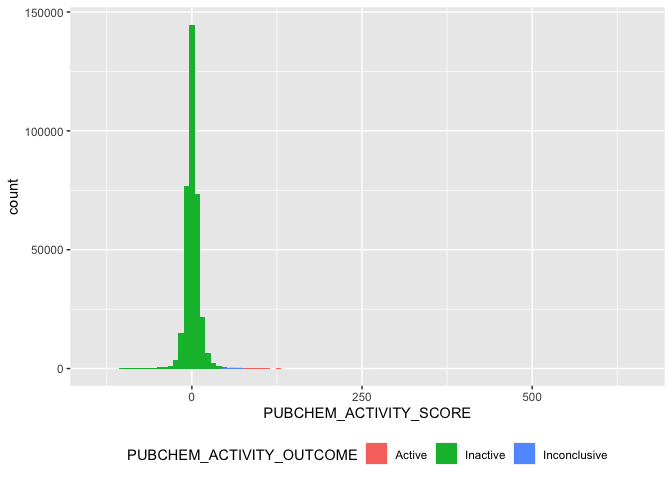
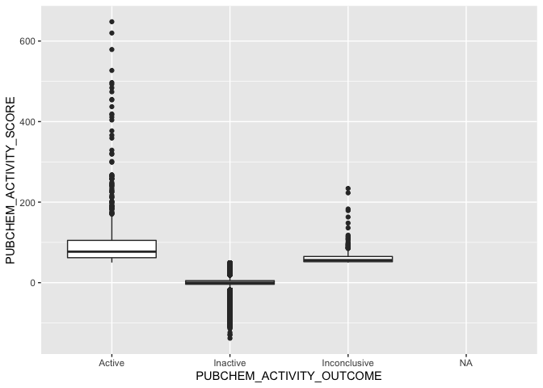
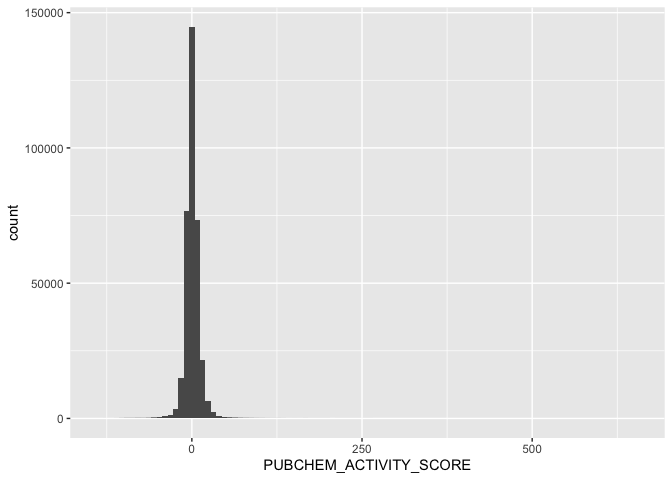
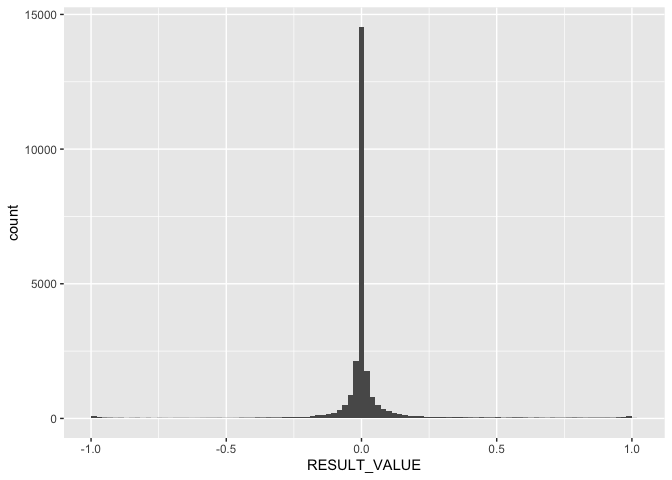

Inspect PGC1a screen
================

``` r
library(magrittr)
library(tidyverse)
```

Trail that led me to the data

1.  [Paper](https://www.cell.com/cell/fulltext/S0092-8674(17)30249-0#secsectitle0075)
2.  [Project page](https://pubchem.ncbi.nlm.nih.gov/bioassay/651721)
3.  [Dataset within the
    project](https://pubchem.ncbi.nlm.nih.gov/bioassay/651723#section=Data-Table)

The “Download data table” and you get this URL below

``` r
screen <- read_csv("https://pubchem.ncbi.nlm.nih.gov/assay/pcget.cgi?query=download&record_type=datatable&actvty=all&response_type=save&aid=651723")
```

    ## Rows: 349099 Columns: 11
    ## ── Column specification ─────────────────────────────────────────────────────────────────────────────────
    ## Delimiter: ","
    ## chr (6): PUBCHEM_RESULT_TAG, PUBCHEM_ACTIVITY_OUTCOME, REPRODUCIBILITY_COSINE_TRANSFORM, PCT_ACTIVE_R...
    ## dbl (3): PUBCHEM_SID, PUBCHEM_CID, PUBCHEM_ACTIVITY_SCORE
    ## lgl (2): PUBCHEM_ACTIVITY_URL, PUBCHEM_ASSAYDATA_COMMENT
    ## 
    ## ℹ Use `spec()` to retrieve the full column specification for this data.
    ## ℹ Specify the column types or set `show_col_types = FALSE` to quiet this message.

``` r
set.seed(42)
screen %>% 
  sample_n(10)
```

<div class="kable-table">

| PUBCHEM\_RESULT\_TAG | PUBCHEM\_SID | PUBCHEM\_CID | PUBCHEM\_ACTIVITY\_OUTCOME | PUBCHEM\_ACTIVITY\_SCORE | PUBCHEM\_ACTIVITY\_URL | PUBCHEM\_ASSAYDATA\_COMMENT | REPRODUCIBILITY\_COSINE\_TRANSFORM | PCT\_ACTIVE\_REPLICATES | REPLICATE\_A\_ACTIVITY\_SCORE\_15.56uM\_(%) | REPLICATE\_B\_ACTIVITY\_SCORE\_15.56uM\_(%) |
|:---------------------|-------------:|-------------:|:---------------------------|-------------------------:|:-----------------------|:----------------------------|:-----------------------------------|:------------------------|:--------------------------------------------|:--------------------------------------------|
| 61409                |     24840167 |      2576558 | Inactive                   |                        2 | NA                     | NA                          | 0.2147                             | 0                       | -6.83                                       | -6.279                                      |
| 54421                |     92763550 |     25604241 | Inactive                   |                      -10 | NA                     | NA                          | 0.955                              | 0                       | -7.545                                      | -14.348                                     |
| 99552                |      7975784 |      2913340 | Inactive                   |                       -6 | NA                     | NA                          | 0.6016                             | 0                       | 2.129                                       | -15.126                                     |
| 74358                |     49826609 |     24819407 | Inactive                   |                        5 | NA                     | NA                          | 0.9889                             | 0                       | 4.699                                       | 6.36                                        |
| 46204                |     57268526 |      4018760 | Inactive                   |                        0 | NA                     | NA                          | 0.0403                             | 0                       | -5.132                                      | 4.734                                       |
| 61601                |     17402696 |      1472482 | Inactive                   |                      -10 | NA                     | NA                          | 0.5923                             | 0                       | 6.878                                       | -6.448                                      |
| 335376               |    131433494 |     54637222 | Inactive                   |                       -5 | NA                     | NA                          | 0.7429                             | 0                       | -0.535                                      | -10.271                                     |
| 102254               |     14733067 |      3751368 | Inactive                   |                       -4 | NA                     | NA                          | 0.9704                             | 0                       | -3.242                                      | -5.392                                      |
| 62037                |       862980 |       664218 | Inactive                   |                       -2 | NA                     | NA                          | 0.3786                             | 0                       | 0.288                                       | 4.575                                       |
| 164768               |       853286 |       655938 | Inactive                   |                       -7 | NA                     | NA                          | 0.7523                             | 0                       | -13.733                                     | -0.911                                      |

</div>

``` r
screen %>%
  ggplot(aes(PUBCHEM_ACTIVITY_SCORE, fill = PUBCHEM_ACTIVITY_OUTCOME)) + 
  geom_histogram(bins = 100) + 
  theme(legend.position = "bottom")
```

    ## Warning: Removed 4 rows containing non-finite values (stat_bin).

<!-- -->

``` r
screen %>%
  ggplot(aes(PUBCHEM_ACTIVITY_OUTCOME, PUBCHEM_ACTIVITY_SCORE, )) + 
  geom_boxplot()
```

    ## Warning: Removed 4 rows containing non-finite values (stat_boxplot).

<!-- -->

``` r
screen %>%
  count(PUBCHEM_ACTIVITY_OUTCOME)
```

<div class="kable-table">

| PUBCHEM\_ACTIVITY\_OUTCOME |      n |
|:---------------------------|-------:|
| Active                     |    741 |
| Inactive                   | 347966 |
| Inconclusive               |    388 |
| NA                         |      4 |

</div>

Save the CIDs and then query
<https://pubchem.ncbi.nlm.nih.gov/pc_fetch/pc_fetch.cgi>

``` r
screen %>%
  select(PUBCHEM_CID) %>%
  na.omit() %>%
  write_tsv("~/Downloads/pgc1a_screen_cid.txt", col_names = FALSE)
```

The results were saved in `input/3843044851509932684.txt.gz`

``` r
smiles_cid <- read_tsv("input/3843044851509932684.txt.gz", col_names = c("PUBCHEM_CID", "CBP_SMILES"))
```

    ## Rows: 345870 Columns: 2
    ## ── Column specification ─────────────────────────────────────────────────────────────────────────────────
    ## Delimiter: "\t"
    ## chr (1): CBP_SMILES
    ## dbl (1): PUBCHEM_CID
    ## 
    ## ℹ Use `spec()` to retrieve the full column specification for this data.
    ## ℹ Specify the column types or set `show_col_types = FALSE` to quiet this message.

``` r
screen %>%
  inner_join(smiles_cid) %>%
  write_csv("input/pgc1a_screen.csv.gz")
```

    ## Joining, by = "PUBCHEM_CID"

I also looked up assay data from the [PUMA
paper](https://www.biorxiv.org/content/10.1101/2020.12.15.422887v1),
saved here:
<https://imaging-platform.s3.us-east-1.amazonaws.com/projects/2018_01_09_PUMA_CBTS/workspace/analysis/puma_data/assays_with_many_compounds.csv>

`CBIP_2139-01` is this assay, which I then saved in `input/`

``` r
screen_internal <- read_csv("input/puma_assay_data_CBIP_2139-01.csv.gz")
```

    ## Rows: 25388 Columns: 15
    ## ── Column specification ─────────────────────────────────────────────────────────────────────────────────
    ## Delimiter: ","
    ## chr (6): ASSAY_NAME, ASSAY_DESC, ASSAY_DB_ID, OBS_NAME, OBS_SOURCE, BRD_ID
    ## dbl (9): ASSAY_ID, ASSAY_OBS_ID, RESULT_VALUE, ASSAY_UMOL_CONC, CPD_ID, n_compounds, n_cpd_ids, n_brd...
    ## 
    ## ℹ Use `spec()` to retrieve the full column specification for this data.
    ## ℹ Specify the column types or set `show_col_types = FALSE` to quiet this message.

Compare the distributions of the two different versions of the screen.
`screen_internal` has fewer because it was already filtered for those
that were present in the CDRP dataset.

``` r
screen %>% ggplot(aes(PUBCHEM_ACTIVITY_SCORE)) + geom_histogram(bins = 100)
```

    ## Warning: Removed 4 rows containing non-finite values (stat_bin).

<!-- -->

``` r
screen_internal %>% ggplot(aes(RESULT_VALUE)) + geom_histogram(bins = 100)
```

<!-- -->
`screen_internal` is normalized from -1 to 1

> We prepared assay performance profiles following a double sigmoid
> normalization procedure to ensure that all readouts are scaled in the
> same range
> <https://www.biorxiv.org/content/10.1101/2020.12.15.422887v1.full>
