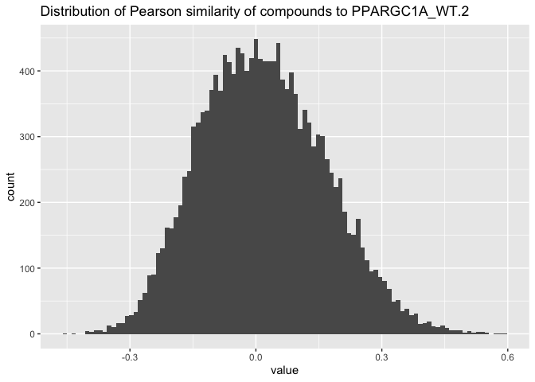

Inspect gene-compound connections
================

``` r
library(magrittr)
library(glue)
library(tidyverse)
```

This file was very likely created using this code
<a href="https://github.com/broadinstitute/2016_08_22_Gene_Compound/blob/f08ccc2b4763376dd00010bed559f3d531b61dd2/archive/CDRP_per_gene_analysis_mutants.Rmd\#L335-L339" class="uri">https://github.com/broadinstitute/2016_08_22_Gene_Compound/blob/f08ccc2b4763376dd00010bed559f3d531b61dd2/archive/CDRP_per_gene_analysis_mutants.Rmd\#L335-L339</a>

i.e. it has the Pearson correlation between genes and compounds

``` r
connections <- readRDS("../archive/rds_files/cr_melt_cp.rds")
```

``` r
set.seed(42)
connections %>%
  sample_n(10)
```

<div class="kable-table">

| Var1                   | Var2           |      value |
|:-----------------------|:---------------|-----------:|
| BRD-K96900359-001-01-6 | PTEN\_WT       |  0.0201357 |
| BRD-K37794655-001-05-7 | AKT1S1\_WT.2   |  0.4353168 |
| BRD-K26924781-001-01-9 | GSK3B\_WT.1    |  0.2483352 |
| BRD-K76624532-001-01-6 | RAC1\_Q61L     |  0.1688656 |
| BRD-A10216015-001-06-7 | PTEN\_WT       |  0.4089549 |
| BRD-K78623196-001-05-4 | PPARGC1A\_WT.2 | -0.1716521 |
| BRD-K82538319-001-01-9 | CRY1\_WT.1     | -0.0001882 |
| BRD-A31650268-001-05-8 | YAP1\_WT.1     | -0.2440378 |
| BRD-K11687039-001-01-9 | MOS\_WT.1      | -0.1712846 |
| BRD-K55677650-003-01-1 | YAP1\_WT.3     |  0.1124160 |

</div>

``` r
connections %>%
  filter(Var2 == "PPARGC1A_WT.2") %>%
  count(name = "Number of connections with compounds")
```

<div class="kable-table">

| Number of connections with compounds |
|-------------------------------------:|
|                                15864 |

</div>

``` r
connections %>%
  filter(Var2 == "PPARGC1A_WT.2") %>%
  ggplot(aes(value)) + geom_histogram(bins = 100) +
  ggtitle("Distribution of Pearson similarity of compounds to PPARGC1A_WT.2")
```

<!-- -->

We need `PUBCHEM_CID` from the `Var1` column

`Var1` is `CPD_NAME`, which was loaded here

<a href="https://github.com/broadinstitute/2016_08_22_Gene_Compound/blob/f08ccc2b4763376dd00010bed559f3d531b61dd2/archive/CDRP_per_gene_analysis_mutants.Rmd\#L101" class="uri">https://github.com/broadinstitute/2016_08_22_Gene_Compound/blob/f08ccc2b4763376dd00010bed559f3d531b61dd2/archive/CDRP_per_gene_analysis_mutants.Rmd\#L101</a>

Let’s load the CDRP metadata

``` r
cdrp_cpd_metadata <-
  read_csv("input/CDP2/cdrp.cpd.meta.csv") %>%
  mutate(CPD_NAME = tolower(CPD_NAME))
```

    ## Rows: 32324 Columns: 7
    ## ── Column specification ─────────────────────────────────────────────────────────────────────────────────
    ## Delimiter: ","
    ## chr (5): BROAD_CPD_ID, CPD_NAME, CPD_NAME_TYPE, cpd_type, CBP_SMILES
    ## dbl (2): idCDP, CPD_ID
    ##
    ## ℹ Use `spec()` to retrieve the full column specification for this data.
    ## ℹ Specify the column types or set `show_col_types = FALSE` to quiet this message.

``` r
set.seed(42)
cdrp_cpd_metadata %>%
  sample_n(10)
```

<div class="kable-table">

| idCDP | BROAD\_CPD\_ID | CPD\_ID | CPD\_NAME     | CPD\_NAME\_TYPE | cpd\_type | CBP\_SMILES                                                                                            |
|------:|:---------------|--------:|:--------------|:----------------|:----------|:-------------------------------------------------------------------------------------------------------|
| 27185 | BRD-K07813038  |  188101 | brd-k07813038 | BROAD\_CPD\_ID  | MLP       | C(N1CCCc2ccccc12)c1nnc2CCCCCn12                                                                        |
| 28645 | BRD-K06188726  |    2882 | brd-k06188726 | BROAD\_CPD\_ID  | MLP       | CCSc1nnc(c(O)n1)-c1ccccc1NC(=O)CC                                                                      |
| 18753 | BRD-K81669067  |  377659 | brd-k81669067 | BROAD\_CPD\_ID  | DOS       | OC\[C@ @H\]1O[C@H](CC(=O)NCc2ccccn2)C

                                                                                  

                                                                                  2\[C@ @H\]1Oc1ccc(NC(=O)CC3CC3)cc21                                                                     |
| 21657 | BRD-K74799293  |  626598 | brd-k74799293 | BROAD\_CPD\_ID  | DOS       | CN1\[C@ @H\](\[C@ @H\](CO)\[C@ @H\]2Cn3c(ccc(-c4cncnc4)c3=O)

                                                                                  

                                                                                  12)C(=O)NC1Cc2ccccc2C1                                                                                  |
|  9290 | BRD-K70791360  |  409691 | brd-k70791360 | BROAD\_CPD\_ID  | DOS       | CC(C)CC\#Cc1ccc2c(O\[C@ @H\](CN(C)C(=O)CC3CC3)\[C@ @H\](C)CN(\[C@ @H\](C)CO)S2(=O)=O)c1                |
|  1252 | BRD-K45091989  |  312081 | brd-k45091989 | BROAD\_CPD\_ID  | MLP       | CN1CCN(CC1)c1ccc(NC(=O)c2ccc(o2)-c2ccc(Cl)cc2)cc1                                                      |
| 15506 | BRD-K03902789  |  597198 | brd-k03902789 | BROAD\_CPD\_ID  | DOS       | COc1ccc(NC(=O)N\[C@ @H\]2CC\[C@ @H\](CCn3cc(nn3)-c3ccccn3)O\[C@ @H\]2CO)cc1                            |
|  8826 | BRD-K87875370  |  410617 | brd-k87875370 | BROAD\_CPD\_ID  | DOS       | C\[C@ @H\](CO)N1C\[C@ @H\](C)\[C@ @H\](CN(C)C(=O)CN2CCOCC2)Oc2cc(=C)ccc2S1(=O)=O                       |
| 10289 | BRD-K54061956  |  452396 | brd-k54061956 | BROAD\_CPD\_ID  | DOS       | C[C@H](CO)N1C\[C@ @H\](C)\[C@ @H\](CN(C)Cc2ccc(cc2)C(=O)Nc2ccccc2N)OCc2cn(CCCC1=O)nn2                  |
| 13440 | BRD-K58774452  |  601782 | brd-k58774452 | BROAD\_CPD\_ID  | DOS       | CCC(=O)N1C[C@H](C)[C@H](CN(C)C(=O)c2cc(NC(=O)NC(C)C)ccc2OC%5BC@@H%5D1C)OC                              |

</div>

``` r
connections <-
  connections %>%
  left_join(
    connections %>%
      select(Var1) %>%
      inner_join(
        cdrp_cpd_metadata %>%
          select(CPD_NAME, BROAD_CPD_ID),
        by = c("Var1" = "CPD_NAME")
      ) %>%
      distinct()
  ) %>%
  mutate(BROAD_CPD_ID =
           ifelse(is.na(BROAD_CPD_ID),
                  str_sub(Var1, 1, 13),
                  BROAD_CPD_ID)) %>%
  inner_join(cdrp_cpd_metadata %>% select(BROAD_CPD_ID, cpd_type, CBP_SMILES))
```

    ## Joining, by = "Var1"
    ## Joining, by = "BROAD_CPD_ID"

We now have `BROAD_CPD_ID` for all compounds

``` r
set.seed(42)
connections %>%
  sample_n(10)
```

<div class="kable-table">

| Var1                   | Var2           |      value | BROAD\_CPD\_ID | cpd\_type | CBP\_SMILES                                                                                            |
|:-----------------------|:---------------|-----------:|:---------------|:----------|:-------------------------------------------------------------------------------------------------------|
| BRD-K74639017-001-01-0 | PTEN\_WT       |  0.0364617 | BRD-K74639017  | DOS       | COC(=O)C\[C@ @H\]1C\[C@ @H\]2\[C@ @H\](Oc3ccc(NC(=O)c4ccc5OCOc5c4)cc23)[C@H](CO)O1                     |
| BRD-K36778976-001-01-2 | AKT1S1\_WT.2   | -0.0046880 | BRD-K36778976  | DOS       | C\[C@ @H\](CO)N1C[C@H](C)[C@H](CN(C)C(=O)C2CCCCC2)OCCCC\[C@ @H\](C)Oc2ccc(cc2C1=O)N(C)C                |
| BRD-K13941052-001-01-0 | GSK3B\_WT.1    |  0.2669709 | BRD-K13941052  | DOS       | CC(C)NC(=O)Nc1ccc2O\[C@ @H\](CN(C)Cc3ccc(cc3)C(O)=O)\[C@ @H\](C)CN(\[C@ @H\](C)CO)C(=O)c2c1            |
| BRD-K54148510-001-01-8 | RAC1\_Q61L     |  0.2730935 | BRD-K54148510  | DOS       | C\[C@ @H\](CO)N1C[C@H](C)[C@H](CN(C)Cc2ccc3OCOc3c2)Oc2ccc(NC(=O)CCC(F)(F)F)cc2C1=O                     |
| boc-gvv-cho            | PRKCZ\_WT.2    |  0.1422907 | BRD-K79053258  | BIO       | CC(C)[C@H](NC(=O)%5BC@@H%5D(NC(=O)CNC(=O)OC(C)(C)C)C(C)C)C=O                                           |
| BRD-K59650319-003-01-7 | PPARGC1A\_WT.2 | -0.0512839 | BRD-K59650319  | BIO       | CN(C1CCCCC1)C(=O)c1sc2nc3ccc(N)cc3n2c1C                                                                |
| BRD-K74688087-001-06-1 | CRY1\_WT.1     |  0.0672458 | BRD-K74688087  | MLP       | COc1ccc(CCNc2ccc(cc2[N+](%5BO-%5D)=O)C(O)=O)cc1OC                                                      |
| BRD-K70542395-001-05-3 | XBP1\_WT.2     |  0.2117146 | BRD-K70542395  | MLP       | CC(=O)n1cc(C=NNC(=O)c2sc(C)nc2C)c2ccccc12                                                              |
| tetracycline           | MOS\_WT.1      | -0.0344407 | BRD-A34788695  | BIO       | CN(C)

                                                                                     

                                                                                     1\[C@ @H\]2C

                                                                                     

                                                                                     3C(C(=O)c4c(O)cccc4

                                                                                     

                                                                                     3(C)O)C(=O)

                                                                                     

                                                                                     2(O)C(=O)C(C(N)=O)C1=O                                                                                  |
| BRD-K22701871-001-05-7 | YAP1\_WT.3     |  0.4014607 | BRD-K22701871  | MLP       | CS(=O)(=O)N1CCC(CC1)C(=O)Nc1cc(ccc1Cl)C(F)(F)F                                                         |

</div>

``` r
connections %>%
  distinct(BROAD_CPD_ID, cpd_type) %>%
  count(cpd_type)
```

<div class="kable-table">

| cpd\_type |    n |
|:----------|-----:|
| BIO       | 1184 |
| DOS       | 8140 |
| MLP       | 6331 |
| NOM       |  189 |
| POS       |    6 |

</div>

``` r
connections %>%
  filter(Var2 == "PPARGC1A_WT.2") %>%
  select(BROAD_CPD_ID, CBP_SMILES, value) %>%
  write_csv("input/PPARGC1A_WT_2_compound_connections.csv.gz")
```
