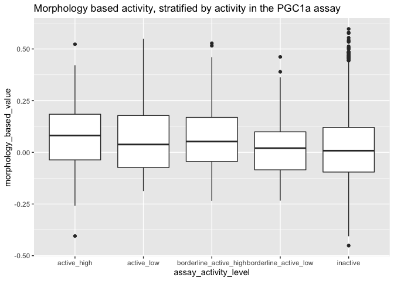
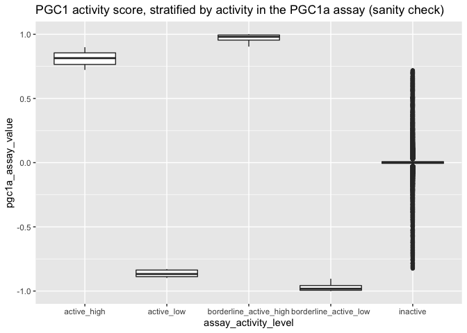

Combine PGC1a screen and Cell Painting
================

``` r
library(magrittr)
library(glue)
library(tidyverse)
```

Load PGC1a screen

``` r
screen <- read_csv("input/pgc1a_screen.csv.gz")
```

    ## Rows: 349076 Columns: 12
    ## ── Column specification ─────────────────────────────────────────────────────────────────────────────────
    ## Delimiter: ","
    ## chr (2): PUBCHEM_ACTIVITY_OUTCOME, CBP_SMILES
    ## dbl (8): PUBCHEM_RESULT_TAG, PUBCHEM_SID, PUBCHEM_CID, PUBCHEM_ACTIVITY_SCORE, REPRODUCIBILITY_COSINE...
    ## lgl (2): PUBCHEM_ACTIVITY_URL, PUBCHEM_ASSAYDATA_COMMENT
    ## 
    ## ℹ Use `spec()` to retrieve the full column specification for this data.
    ## ℹ Specify the column types or set `show_col_types = FALSE` to quiet this message.

Load Cell Painting connections to `PPARGC1A_WT`

``` r
connections <- read_csv("input/PPARGC1A_WT_2_compound_connections.csv.gz")
```

    ## Rows: 15910 Columns: 3
    ## ── Column specification ─────────────────────────────────────────────────────────────────────────────────
    ## Delimiter: ","
    ## chr (2): BROAD_CPD_ID, CBP_SMILES
    ## dbl (1): value
    ## 
    ## ℹ Use `spec()` to retrieve the full column specification for this data.
    ## ℹ Specify the column types or set `show_col_types = FALSE` to quiet this message.

``` r
set.seed(42)
screen %>% sample_n(10)
```

<div class="kable-table">

| PUBCHEM\_RESULT\_TAG | PUBCHEM\_SID | PUBCHEM\_CID | PUBCHEM\_ACTIVITY\_OUTCOME | PUBCHEM\_ACTIVITY\_SCORE | PUBCHEM\_ACTIVITY\_URL | PUBCHEM\_ASSAYDATA\_COMMENT | REPRODUCIBILITY\_COSINE\_TRANSFORM | PCT\_ACTIVE\_REPLICATES | REPLICATE\_A\_ACTIVITY\_SCORE\_15.56uM\_(%) | REPLICATE\_B\_ACTIVITY\_SCORE\_15.56uM\_(%) | CBP\_SMILES                                                                                            |
|---------------------:|-------------:|-------------:|:---------------------------|-------------------------:|:-----------------------|:----------------------------|-----------------------------------:|------------------------:|--------------------------------------------:|--------------------------------------------:|:-------------------------------------------------------------------------------------------------------|
|                61413 |       852371 |       654994 | Inactive                   |                        7 | NA                     | NA                          |                             0.8684 |                       0 |                                       4.996 |                                      14.305 | COC1=CC=C(C=C1)S(=O)(=O)N2CCC(CC2)C(=O)NCC3=CC(=CC=C3)OC                                               |
|                54425 |     89855030 |     44825519 | Inactive                   |                       14 | NA                     | NA                          |                             0.9923 |                       0 |                                      13.054 |                                      16.765 | CC1=CC=CC=C1S(=O)(=O)N2C                                                                               
                                                                                                                                                                                                                                                                                                                                                                                                                                        
                                                                                                                                                                                                                                                                                                                                  
                                                                                                                                                                                                                                                                                                                                                                                                                                        
                                                                                                                                                                                                                                                                                                                                3CON(                                                                                                   
                                                                                                                                                                                                                                                                                                                                                                                                                                        
                                                                                                                                                                                                                                                                                                                                  
                                                                                                                                                                                                                                                                                                                                                                                                                                        
                                                                                                                                                                                                                                                                                                                                3C                                                                                                      
                                                                                                                                                                                                                                                                                                                                                                                                                                        
                                                                                                                                                                                                                                                                                                                                  
                                                                                                                                                                                                                                                                                                                                                                                                                                        
                                                                                                                                                                                                                                                                                                                                2C4=CC=CC(=C4)C5=CC=CC=C5)C                                                                             |
|                99556 |      4264067 |      2217404 | Inactive                   |                        2 | NA                     | NA                          |                             0.9675 |                       0 |                                       1.679 |                                       2.867 | CCOC1=C(C(=CC(=C1)C(=O)O)Cl)OCC\#N                                                                     |
|                74362 |     49828257 |      3821495 | Inactive                   |                       16 | NA                     | NA                          |                             0.9995 |                       0 |                                      16.854 |                                      15.793 | COC1=C(C=C(C=C1)CCNC(=O)C2=CC3=C(N=C4C=CC=CN4C3=O)N(C2=N)CC5=CC=CO5)OC                                 |
|                46208 |     57258553 |     25162566 | Inactive                   |                       17 | NA                     | NA                          |                             0.9478 |                       0 |                                      11.365 |                                      22.892 | CC1CCCCC1NC(=O)C(C)OC(=O)C2CCN(CC2)C3=NC=C(C=C3)C(F)(F)F                                               |
|                61605 |      4244528 |      3239112 | Inactive                   |                      -10 | NA                     | NA                          |                             0.7962 |                       0 |                                      -4.458 |                                      -1.811 | CCOC(=O)CC(=O)CSC1=C(C(=CC(=N1)C2=CN=CC=C2)C)C\#N                                                      |
|               335399 |    131419473 |     54624007 | Inactive                   |                        0 | NA                     | NA                          |                             0.0769 |                       0 |                                      -9.830 |                                      11.474 | C\[C@ @H\]1CN(C(=O)C2=C(N=CC(=C2)C\#CC3=CN=CC=C3)O                                                     
                                                                                                                                                                                                                                                                                                                                                                                                                                        
                                                                                                                                                                                                                                                                                                                                  
                                                                                                                                                                                                                                                                                                                                                                                                                                        
                                                                                                                                                                                                                                                                                                                                1CN(C)C)\[C@ @H\](C)CO                                                                                  |
|               102258 |     14736376 |       750751 | Inactive                   |                       -3 | NA                     | NA                          |                             0.8359 |                       0 |                                      -1.119 |                                      -5.401 | CC1=CC=C(C=C1)NC2=C(C(=CC(=N2)C)C)C(=O)N                                                               |
|                62041 |     14741205 |       919386 | Inactive                   |                       18 | NA                     | NA                          |                             0.8998 |                       0 |                                      10.879 |                                      19.295 | CC1=CC2=C(C=C1)NC3=C2N=CN(C3=O)CCC4=CN=CN4                                                             |
|               164772 |     14734065 |      2898109 | Inactive                   |                       -3 | NA                     | NA                          |                             0.5208 |                       0 |                                      -9.367 |                                       2.269 | CC(C(=O)O)OC1=CC2=C(C=C1)C(=CC(=O)O2)C3=CC=C(C=C3)OC                                                   |

</div>

``` r
connections %>% sample_n(10)
```

<div class="kable-table">

| BROAD\_CPD\_ID | CBP\_SMILES                                                                                            |      value |
|:---------------|:-------------------------------------------------------------------------------------------------------|-----------:|
| BRD-K53874318  | C[C@H](CO)N1C[C@H](C)\[C@ @H\](CN(C)C)OCCCC[C@H](C)Oc2ccc(NC(=O)Nc3cccc4ccccc34)cc2C1=O                |  0.2197471 |
| BRD-K60760423  | C\[C@ @H\](CO)N1C[C@H](C)[C@H](CN(C)Cc2ccc(Cl)c(Cl)c2)Oc2ccc(NS(=O)(=O)c3cn(C)cn3)cc2CC1=O             |  0.0498674 |
| BRD-K79112806  | CC(C)NC(=O)Nc1ccc2O\[C@ @H\](C)CCCCO[C@H](CN(C)C(=O)NC(C)C)\[C@ @H\](C)CN([C@H](C)CO)C(=O)c2c1         |  0.1500353 |
| BRD-K29824954  | C[C@H](CO)N1C[C@H](C)\[C@ @H\](CN(C)Cc2cccc(c2)C(O)=O)Oc2cc(ccc2S1(=O)=O)C\#CCC1CCCC1                  | -0.0906954 |
| BRD-K97865195  | O=C(Nc1ccc2OCOc2c1)c1cnc2SCCn2c1=O                                                                     | -0.1511495 |
| BRD-K18511213  | CC(C)c1ccc(NC(=O)C                                                                                     
                                                                                                                          
                    
                                                                                                                          
                  2CC                                                                                                     
                                                                                                                          
                    
                                                                                                                          
                  3\[C@ @H\](COc4ccc(NC(=O)Nc5ccc(F)c(F)c5)cc4C(=O)N3C)O2)cc1                                             |  0.2432774 |
| BRD-K52885700  | CC(C)c1cc(cs1)-c1nnc(S)n1-c1cccc(C)c1                                                                  | -0.0138842 |
| BRD-K74121099  | CCN(CC)S(=O)(=O)c1cc(C(=O)Nc2nncs2)c(Cl)cc1Cl                                                          | -0.1240322 |
| BRD-A16346972  | COc1ccc(cc1OC)C1CC(=O)c2c(C)nc(nc2C1)N1CCN(Cc2ccccc2)CC1                                               | -0.0451680 |
| BRD-K28575960  | CCN(CCCNC(=O)c1c(C)cc(=O)oc1C)c1ccccc1                                                                 | -0.1261679 |

</div>

``` r
screen_connections <- inner_join(screen, connections)
```

    ## Joining, by = "CBP_SMILES"

Sadly this gets us nowhere

``` r
count(screen_connections)
```

<div class="kable-table">

|   n |
|----:|
|   2 |

</div>

Let’s try with the PUMA version

``` r
screen_internal <- read_csv("input/puma_assay_data_CBIP_2139-01.csv.gz")
```

    ## Rows: 25388 Columns: 15
    ## ── Column specification ─────────────────────────────────────────────────────────────────────────────────
    ## Delimiter: ","
    ## chr (6): ASSAY_NAME, ASSAY_DESC, ASSAY_DB_ID, OBS_NAME, OBS_SOURCE, BRD_ID
    ## dbl (9): ASSAY_ID, ASSAY_OBS_ID, RESULT_VALUE, ASSAY_UMOL_CONC, CPD_ID, n_compounds, n_cpd_ids, n_brd...
    ## 
    ## ℹ Use `spec()` to retrieve the full column specification for this data.
    ## ℹ Specify the column types or set `show_col_types = FALSE` to quiet this message.

``` r
screen_internal %>% 
  ggplot(aes(RESULT_VALUE, fill = as.factor(Class))) + 
  geom_histogram(bins = 100) + 
  facet_wrap(~Class, ncol = 1, scales = "free_y") 
```

<!-- -->

From the paper: &gt; Compounds with high or low correlations of their
Cell Painting profiles to PPARGC1A overexpression were chosen for
further study (hence all samples are below \~ -0.35 or above \~0.35 on
the X axis).

``` r
screen_internal_connections <-
  inner_join(screen_internal,
             connections,
             by = c("BRD_ID" = "BROAD_CPD_ID")) %>%
  mutate(
    assay_activity_level =
      case_when(
        Class == 0 & RESULT_VALUE > 0 ~ "active_high",
        Class == 0 & RESULT_VALUE < 0 ~ "active_low",
        Class == 1 &
          RESULT_VALUE > 0 ~ "borderline_active_high",
        Class == 1 &
          RESULT_VALUE < 0 ~ "borderline_active_low",
        Class == 2 ~ "inactive",
        TRUE ~ NA_character_
      )
  ) %>%
  mutate(
    morphology_similarity_level =
      case_when(abs(value) > 0.35 ~ "morph_strong",
                TRUE ~ "morph_weak")
  ) %>%
  rename(pgc1a_assay_value = RESULT_VALUE,
         morphology_based_value = value)
```

``` r
screen_internal_connections %>%
  ggplot(aes(assay_activity_level, morphology_based_value)) + geom_boxplot() +
  ggtitle("Morphology based activity, stratified by activity in the PGC1a assay")
```

<!-- -->

``` r
screen_internal_connections %>%
  ggplot(aes(assay_activity_level, pgc1a_assay_value)) + geom_boxplot() +
  ggtitle("PGC1 activity score, stratified by activity in the PGC1a assay (sanity check)")
```

<!-- -->

``` r
screen_internal_connections %>%
  ggplot(aes(morphology_similarity_level, morphology_based_value)) + geom_boxplot() +
  ggtitle("Morphology based activity, stratified by morphology similarity level (sanity check)")
```

<!-- -->

``` r
screen_internal_connections %>%
  ggplot(aes(morphology_similarity_level, pgc1a_assay_value)) + geom_boxplot() +
  ggtitle("PGC1 activity score, stratified by morphology similarity level")
```

<!-- -->

``` r
screen_internal_connections <-
  screen_internal_connections %>%
  mutate(assay_activity_level_simple1 =
           ifelse(
             assay_activity_level %in% c("active_high",
                                         "borderline_active_high"),
             "active",
             "inactive"
           )) %>%
  mutate(assay_activity_level_simple2 =
           ifelse(
             assay_activity_level %in% c("active_high",
                                         "borderline_active_high",
                                         "active_low",
                                         "borderline_active_low"),
             "active",
             "inactive"
           ))
```

``` r
screen_internal_connections %>%
  count(morphology_similarity_level, assay_activity_level)
```

<div class="kable-table">

| morphology\_similarity\_level | assay\_activity\_level   |     n |
|:------------------------------|:-------------------------|------:|
| morph\_strong                 | active\_high             |     4 |
| morph\_strong                 | active\_low              |     1 |
| morph\_strong                 | borderline\_active\_high |    11 |
| morph\_strong                 | borderline\_active\_low  |     4 |
| morph\_strong                 | inactive                 |   200 |
| morph\_weak                   | active\_high             |   106 |
| morph\_weak                   | active\_low              |    25 |
| morph\_weak                   | borderline\_active\_high |   130 |
| morph\_weak                   | borderline\_active\_low  |   100 |
| morph\_weak                   | inactive                 | 12382 |

</div>

``` r
screen_internal_connections %>%
  count(morphology_similarity_level, assay_activity_level_simple1)
```

<div class="kable-table">

| morphology\_similarity\_level | assay\_activity\_level\_simple1 |     n |
|:------------------------------|:--------------------------------|------:|
| morph\_strong                 | active                          |    15 |
| morph\_strong                 | inactive                        |   205 |
| morph\_weak                   | active                          |   236 |
| morph\_weak                   | inactive                        | 12507 |

</div>

``` r
screen_internal_connections %>%
  count(morphology_similarity_level, assay_activity_level_simple2)
```

<div class="kable-table">

| morphology\_similarity\_level | assay\_activity\_level\_simple2 |     n |
|:------------------------------|:--------------------------------|------:|
| morph\_strong                 | active                          |    20 |
| morph\_strong                 | inactive                        |   200 |
| morph\_weak                   | active                          |   361 |
| morph\_weak                   | inactive                        | 12382 |

</div>

``` r
with(screen_internal_connections, 
     fisher.test(
       morphology_similarity_level, 
       assay_activity_level_simple1, 
       alternative = "greater")) %>%
  broom::tidy()
```

<div class="kable-table">

| estimate | p.value | conf.low | conf.high | method                             | alternative |
|---------:|--------:|---------:|----------:|:-----------------------------------|:------------|
| 3.877012 | 2.5e-05 | 2.318945 |       Inf | Fisher’s Exact Test for Count Data | greater     |

</div>

``` r
with(screen_internal_connections, 
     fisher.test(
       morphology_similarity_level, 
       assay_activity_level_simple2, 
       alternative = "greater")) %>%
  broom::tidy()
```

<div class="kable-table">

| estimate | p.value | conf.low | conf.high | method                             | alternative |
|---------:|--------:|---------:|----------:|:-----------------------------------|:------------|
| 3.429321 | 7.7e-06 | 2.206964 |       Inf | Fisher’s Exact Test for Count Data | greater     |

</div>
